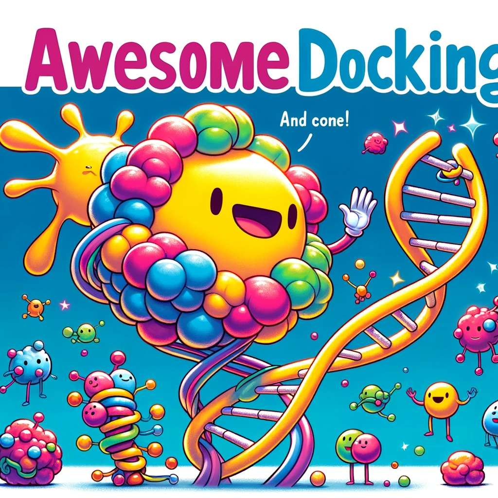

<h1 align="center">
🧬 Awesome Docking
</h1>

  
    

  

Alphafold-latest🔥 and RFAA🔥 have revolutionize the scope of docking. Previous work was focused on modeling different components separately, but these two studies have used a single model to simultaneously model all biomolecular interactions. Here is a curated paper list containing all kinds of deep learning-based docking, covering **Protein-Ligand Docking**, **Protein-Protein Docking**, **Protein-Nucleic Acid Docking**, and **Covalent Docking**. Additionally, we refer to works capable of handling various types of docking scenarios simultaneously as '**Versatile Docking**'. Future work will encompass tools, datasets, scoring function design, and other relvant topics. Within each category, entries are listed in reverse chronological order, with the most recent first. If a paper has multiple versions, we reference the initial publication date. The following badges are used for according purpose: 

     

If you have a paper or resource you'd like to add, please submit a pull request or open an issue.

## Categories

- [Versatile Docking](#versatile-docking)
- [Survey](#survey)
- [Protein-Ligand Docking](#protein-ligand-docking)
  - [Year 2023 -- Protein-Ligand](#year-2023----protein-ligand)
  - [Year 2022 -- Protein-Ligand](#year-2022----protein-ligand)
- [Protein-Protein Docking](#protein-protein-docking)
  - [Year 2023 -- Protein-Protein](#year-2023----protein-protein)
  - [Year 2022 -- Protein-Protein](#year-2022----protein-protein)
- [Protein-Nucleic Acid Docking](#protein-nucleic-acid-docking)
- [Covalent Docking](#covalent-docking)

---

## Versatile Docking

🔥**A glimpse of the next generation of AlphaFold**   
Google DeepMind AlphaFold team and Isomorphic Labs team  
*News, October 2023*  

    
🔥**Generalized Biomolecular Modeling and Design with RoseTTAFold All-Atom**
Rohith Krishna, Jue Wang, Woody Ahern, Pascal Sturmfels, Preetham Venkatesh, Indrek Kalvet, Gyu Rie Lee, Felix S Morey-Burrows, Ivan Anishchenko, Ian R Humphreys, Ryan McHugh, Dionne Vafeados, Xinting Li, George A Sutherland, Andrew Hitchcock, C Neil Hunter, Minkyung Baek, Frank DiMaio, David Baker  
*Preprint, October 2023*  

## Survey

## Protein-Ligand Docking
### Year 2023 -- Protein-Ligand 

**Structure prediction of protein-ligand complexes from sequence information with Umol**  
Patrick Bryant, Atharva Kelkar, Andrea Guljas, Cecilia Clementi, Frank Noé  
*Preprint, November 2023*  

 

**PoseBusters: AI-based docking methods fail to generate physically valid poses or generalise to novel sequences**  
Martin Buttenschoen, Garrett M. Morris, Charlotte M. Deane  
*Preprint, October 2023.*  

 

**FABind: Fast and Accurate Protein-Ligand Binding**  
Qizhi Pei, Kaiyuan Gao, Lijun Wu, Jinhua Zhu, Yingce Xia, Shufang Xie, Tao Qin, Kun He, Tie-Yan Liu, Rui Yan  
*NeurIPS, September 2023*  

 

**Efficient and accurate large library ligand docking with KarmaDock**  
Xujun Zhang, Odin Zhang, Chao Shen, Wanglin Qu, Shicheng Chen, Hanqun Cao, Yu Kang, Zhe Wang, Ercheng Wang, Jintu Zhang, Yafeng Deng, Furui Liu, Tianyue Wang, Hongyan Du, Langcheng Wang, Peichen Pan, Guangyong Chen, Chang-Yu Hsieh, Tingjun Hou  
*Nature Computational Science, September 2023*  

 

**Do deep learning models really outperform traditional approaches in molecular docking?**  
Yuejiang Yu, Shuqi Lu, Zhifeng Gao, Hang Zheng, Guolin Ke  
*ICLR workshop MLDD, March 2023*  

 

🔥**DiffDock: Diffusion Steps, Twists, and Turns for Molecular Docking**   
Gabriele Corso, Hannes Stärk, Bowen Jing, Regina Barzilay, Tommi Jaakkola  
*ICLR, Feburary 2023*  

 

**Uni-Mol: A Universal 3D Molecular Representation Learning Framework**  
Gengmo Zhou, Zhifeng Gao, Qiankun Ding, Hang Zheng, Hongteng Xu, Zhewei Wei, Linfeng Zhang, Guolin Ke  
*ICLR, Feburary 2023*  

 

**E3Bind: An End-to-End Equivariant Network for Protein-Ligand Docking**  
Yangtian Zhang, Huiyu Cai, Chence Shi, Jian Tang  
*ICLR, Feburary 2023*  

 

### Year 2022 -- Protein-Ligand 

**TANKBind: Trigonometry-Aware Neural NetworKs for Drug-Protein Binding Structure Prediction**  
Wei Lu, Qifeng Wu, Jixian Zhang, Jiahua Rao, Chengtao Li, Shuangjia Zheng  
*NeurIPS, November 2022*  

 

**EquiBind: Geometric Deep Learning for Drug Binding Structure Prediction**  
Hannes Stärk, Octavian Ganea, Lagnajit Pattanaik, Dr.Regina Barzilay, Tommi Jaakkola  
*ICML, July 2022*  

 

## Protein-Protein Docking
### Year 2023 -- Protein-Protein 
### Year 2022 -- Protein-Protein 

## Protein-Nucleic Acid Docking
**Accurate prediction of protein-nucleic acid complexes using RoseTTAFoldNA**  
Minkyung Baek, Ryan McHugh, Ivan Anishchenko, Hanlun Jiang, David Baker, Frank DiMaio  
*Nature Methods, November 2023*  

**EquiPNAS: improved protein-nucleic acid binding site prediction using protein-language-model-informed equivariant deep graph neural networks**  
Rahmatullah Roche, Bernard Moussad, Md Hossain Shuvo, Sumit Tarafder, Debswapna Bhattacharya  
*BioRxiv, September 2023*  

 

**Evaluating native-like structures of RNA-protein complexes through the deep learning method**  
Chengwei Zeng, Yiren Jian, Soroush Vosoughi, Chen Zeng, Yunjie Zhao  
*Nature Communications, February 2023*  

 

**Protein–RNA interaction prediction with deep learning: structure matters**  
Junkang Wei, Siyuan Chen, Licheng Zong, Xin Gao, Yu Li  
*Briefings in Bioinformatics， January 2022*  

 

**Challenges in structural modeling of RNA-protein interactions**  
Xudong Liu, Yingtian Duan, Xu Hong, Juan Xie, Shiyong Liu  
*Current Opinion in Structural Biology, June 2023*  

 

## Covalent Docking

**Docking covalent targets for drug discovery: stimulating the computer-aided drug design community of possible pitfalls and erroneous practices**  
A. Oyedele, A. Ogunlana, I. Boyenle, A. Adeyemi, Temionu Oluwakemi Rita, Temitope Isaac Adelusi, M. Abdul-Hammed, Oluwabamise Emmanuel Elegbeleye, Tope T. Odunitan   
*Molecular Diversity, September 2022*  

  

**Cov_DOX: A Method for Structure Prediction of Covalent Protein–Ligand Bindings**  
Lin Wei, Yaru Chen, Jiaqi Liu, Li Rao, Yanliang Ren, Xin Xu, Jian Wan  
*Journal of Medicinal Chemistry, March 2022*  

  

**CovPDB: a high-resolution coverage of the covalent protein–ligand interactome**  
Mingjie Gao, Aurélien F. A. Moumbock, Ammar Qaseem, Qianqing Xu, S. Günther  
*Nucleic Acids Research, September 2021*  

 

**Fragment-based covalent ligand discovery**  
Wenchao Lu, M. Kostic, Tinghu Zhang, Jianwei Che, M. Patricelli, L. Jones, Edward T. Chouchani, N. Gray  
*RSC Chemical Biology, February 2021*  

  

**Covalent docking of large libraries for the discovery of chemical probes**  
N. London, Randy M. Miller, Shyam Krishnan, K. Uchida, J. Irwin, O. Eidam, L. Gibold, Peter Cimermancic, R. Bonnet, B. Shoichet, J. Taunton  
*Nature Chemical Biology, September 2014*  

  

**Docking Covalent Inhibitors: A Parameter Free Approach To Pose Prediction and Scoring**  
Kai Zhu, Kenneth W. Borrelli, Jeremy R. Greenwood, Tyler Day, Robert Abel, Ramy S. Farid, and Edward Harder  
*Journal of Chemical Information and Modeling, June 2014*  

  

**CovalentDock: Automated covalent docking with parameterized covalent linkage energy estimation and molecular geometry constraints**  
Xuchang Ouyang, Shuo Zhou, C. Su, Z. Ge, Runtao Li, C. Kwoh  
*Journal of Computational Chemistry, February 2013*  

 
